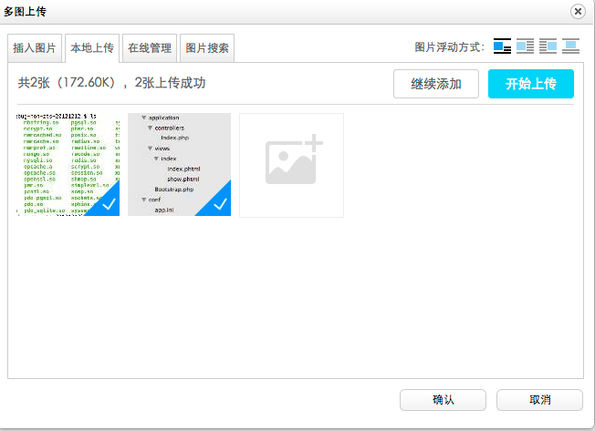
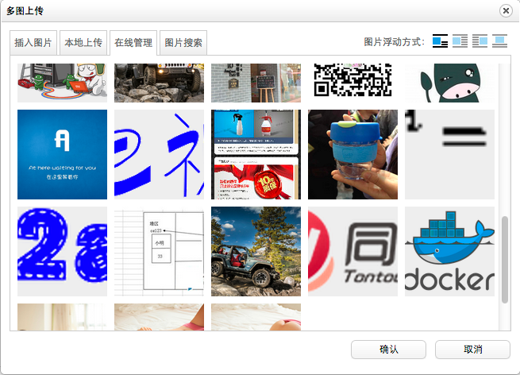

qiniu_ueditor_1.4.3
===================

>UEditor1.4.3版本-直接上传视频、附件、图片到七牛云存储，并且支持图片在线管理功能

###配置

`./php/conf.php`

	//配置$QINIU_ACCESS_KEY和$QINIU_SECRET_KEY 为你自己的key
	$QINIU_ACCESS_KEY	= 'your akey';
	$QINIU_SECRET_KEY	= 'your skey';
	
	//配置bucket为你的bucket
	$BUCKET = "your bucket";
	
	//配置你的域名访问地址
	$HOST  = "your qiniu domain";

然后就可以了!

###上传演示

###图片在线管理

###博客支持技术支持http://www.widuu.com